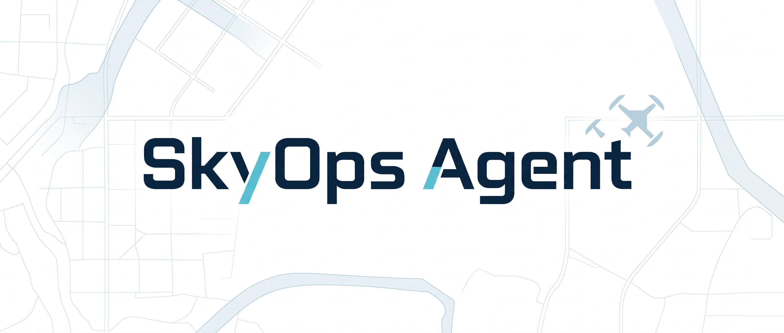

<p align="center">
  
</p>

<h1 align="center">SkyOps Agent</h1>

<p align="center">
  <strong>面向低空作业的任务级自治与风险推演智能体</strong>
</p>

<p align="center">
  从“能飞”走向“会运营”：让深圳低空经济场景中的无人机任务更安全、更可解释、更可复盘。
</p>

<p align="center">
  <a href="./README.md">English</a>
  ·
  <a href="#项目概览">项目概览</a>
  ·
  <a href="#mvp-场景">MVP</a>
  ·
  <a href="#开发路线">路线图</a>
  ·
  <a href="#安全与合规">安全边界</a>
</p>

<p align="center">
  
  
  
  
  
  
</p>

---

## 项目概览

**SkyOps Agent** 是一个面向深圳低空经济与无人机产业场景的低空作业任务自治与风险推演智能体。

它不是无人机缺陷识别系统，不是裂缝识别工具，不是光伏热斑检测工具，也不是无人机底层飞控系统。SkyOps Agent 关注的是作业需求与执行系统之间的智能决策层：

| 它不回答 | 它回答 |
| --- | --- |
| 无人机会不会飞？ | 当前约束下，这个任务该不该飞？ |
| 图像里有没有缺陷？ | 什么时间窗口、航线、起降点和任务拆分方式最安全？ |
| 无人机能否执行底层飞控命令？ | 风速、GPS、电量、空域、人流风险变化时怎么办？ |
| 巡检后能否生成报告？ | 如何形成可解释、可复盘、可持续优化的任务闭环？ |

第一个 MVP 场景是：**深圳某高层建筑外立面巡检任务自治与风险推演**。巡检只是第一个 Demo 场景，产品能力可以扩展到园区安防、工地巡查、园区光伏、应急救援、消防巡查、低空测绘、城市治理、物流配送等低空作业任务。

## 核心定位

SkyOps Agent 位于低空系统的中间决策层：

```text
城市级低空监管 / 空域管理 / UTM 平台
                 |
SkyOps Agent：任务自治与风险推演层
                 |
无人机 / 机库 / 飞控 / 载荷 / 巡检平台
```

它不替代政府低空监管平台，也不替代 DJI 等厂商飞控系统。它的职责是在任务需求和执行系统之间形成可解释、可约束、可复盘的智能决策。

## 核心能力

| 能力 | 含义 |
| --- | --- |
| 主动感知 | 主动补齐任务所需约束，而不是让用户填写大量表单。 |
| 多源约束推理 | 综合天气、风速、光照、人流、空域、GPS、电量、载荷、图传、安全、法规和业务优先级。 |
| 风险推演 | 在任务执行前和执行中进行 what-if 分析。 |
| 自主规划 | 生成飞行时间窗口、起降点、航线策略、任务拆分、安全阈值和中止条件。 |
| 异常重构 | 遇到风速突变、GPS 异常、临时限飞、电量不足、人流聚集等事件时主动重规划。 |
| 闭环复盘 | 生成任务复盘、风险记录、数据质量评分、补飞计划和下次优化建议。 |
| 可解释决策 | 关键决策必须包含依据、权衡、替代方案和需要人工确认的事项。 |

## 架构设计

| Agent | 职责 |
| --- | --- |
| 任务理解 Agent | 从自然语言中抽取作业对象、区域、目标、时间要求、精度要求、风险偏好和特殊限制。 |
| 环境感知 Agent | 整合天气、风速、降雨、能见度、光照、人流、建筑环境、GPS 风险和反光风险。 |
| 空域合规 Agent | 检查禁飞区、限飞区、临时管控区、审批条件、高度限制和合规风险。 |
| 设备状态 Agent | 评估无人机、电池、载荷、相机、热成像、变焦、图传质量和任务续航。 |
| 任务规划 Agent | 生成推荐执行时间、起降点、航线策略、安全距离、拍摄间距、任务拆分、备用方案和中止条件。 |
| 风险推演 Agent | 构建 what-if 风险树，并将触发条件映射到缓解动作和重规划建议。 |
| 异常处置 Agent | 将执行中异常转化为暂停、返航、绕行、备用航线、降级任务、补飞或人工接管决策。 |
| 报告复盘 Agent | 生成任务方案、风险报告、异常记录、补飞计划、数据质量评分和下次优化建议。 |

## 技术栈

SkyOps Agent 采用轻量的前后端分离 monorepo，重点服务于仿真、解释和评测。

| 层级 | 技术 |
| --- | --- |
| 后端 | Python 3.11/3.12, FastAPI |
| 数据模型 | Pydantic v2 |
| 测试 | pytest |
| 格式化 / Lint | Ruff |
| 配置 | python-dotenv, PyYAML |
| 前端 | React, TypeScript, Vite |
| 样式 | Tailwind CSS |
| 图标 | lucide-react |
| 图表 | Recharts |
| 仿真数据 | JSON / YAML mock 数据集 |
| Agent 编排 | Phase 1 使用项目内确定性 orchestrator |

LLM 可用于自然语言任务理解、缺失信息补全建议、解释生成和报告润色。禁飞区、超风速、低电量、GPS 置信度不足、人流密集、返航电量不足等硬安全约束必须由显式规则代码判断，不能只依赖 LLM 自由文本输出。

## 计划目录结构

```text
backend/
  app/
    main.py
    api/
    agents/
    core/
      models/
      rules/
      evaluation/
      orchestration/
      explanation/
    data/
      mock/
      scenarios/
      fixtures/
    integrations/
  tests/

frontend/
  src/
    api/
    components/
    pages/
    features/
      mission/
      risk/
      incident/
      review/
      evaluation/

docs/
.github/
```

## 快速开始

项目当前处于 Phase 0。后端工程基线使用 Python 3.12 和 `uv`。

安装本地工具：

```bash
brew install uv python@3.12
```

安装后端依赖：

```bash
cd backend
uv sync
```

启动后端 API：

```bash
uv run uvicorn app.main:app --reload
```

检查健康接口：

```bash
curl http://127.0.0.1:8000/health
```

运行测试和 lint：

```bash
uv run pytest
uv run ruff check .
```

启动前端 scaffold：

```bash
cd frontend
npm install
npm run dev
```

构建前端：

```bash
npm run build
```

仓库 CI 会在推送到 `main` 或向 `main` 发起 PR 时运行后端测试、后端 Ruff 检查和前端生产构建。

## MVP 场景

> 深圳某高层建筑外立面巡检任务自治与风险推演。

```text
自然语言任务
  -> 任务理解
  -> mock 天气 / 人流 / 空域 / 设备状态
  -> 时间窗口 + 起降点 + 航线策略 + 安全阈值
  -> 异常事件注入
  -> 重规划决策
  -> 任务复盘 + 补飞计划
```

示例任务：

> 明天上午巡检南山区一栋 180 米高办公楼外立面，重点排查幕墙裂缝和脱落风险，要求尽量减少对行人的影响。

示例异常：

- 风速突然升高。
- GPS 置信度下降。
- 图传延迟增加。
- 临时限飞区更新。
- 电量不足。
- 目标区域出现人群聚集。

## 开发路线

| 阶段 | 目标 | 重点工作 |
| --- | --- | --- |
| Phase 0 | 项目基线 | Monorepo、FastAPI 后端、React + Vite + Tailwind 前端、Ruff、pytest、CI。 |
| Phase 1 | 仿真 MVP | Pydantic 模型、mock 数据、显式安全规则、确定性编排、任务方案、异常重规划、复盘报告。 |
| Phase 2 | 可视化 Demo | 低空运营调度台、航线与风险可视化、异常注入、重规划展示、复盘面板。 |
| Phase 3 | 评测集与指标 | 30-50 个仿真场景、硬约束通过率、风险召回率、异常处置得分、可解释性得分。 |
| Phase 4 | 可扩展接口 | 天气、地图、无人机、机库、UTM、巡检结果 adapter，并保留 mock fallback。 |

## 评测指标

| 指标 | 检查内容 |
| --- | --- |
| Hard Constraint Pass Rate / 硬约束通过率 | 禁飞区、风速、电量、返航余量、人流密集、审批要求等硬约束。 |
| Risk Recall / 风险识别召回率 | GPS 遮挡、风速上升、人流高峰、临时限飞、强反光、低能见度、图传延迟等风险。 |
| Plan Efficiency / 方案效率 | 飞行时间、任务拆分次数、覆盖率、补飞面积、人工介入次数和安全余量。 |
| Incident Response Score / 异常处置得分 | 暂停、返航、绕行、数据保存、补飞计划、风险解释和人工接管。 |
| Explainability Score / 可解释性得分 | 关键决策是否说明依据、权衡、替代方案和人工确认需求。 |

## 安全与合规

SkyOps Agent 是低空作业任务决策辅助系统，不是规避监管工具。

系统不得建议绕过禁飞区、忽略审批、压低安全余量，或在人流密集区域冒险飞行。当数据不足或风险不确定时，系统应明确输出：

```text
当前信息不足，建议人工复核/暂停执行/启用保守方案。
```

所有安全规则必须显式、可配置、可测试。mock 数据不得伪装成真实数据。

## 当前状态

项目目前处于规划与脚手架阶段。近期重点是完成 Phase 0 工程基线，然后实现 Phase 1 仿真 MVP。

## 许可证

见 [LICENSE](./LICENSE)。
