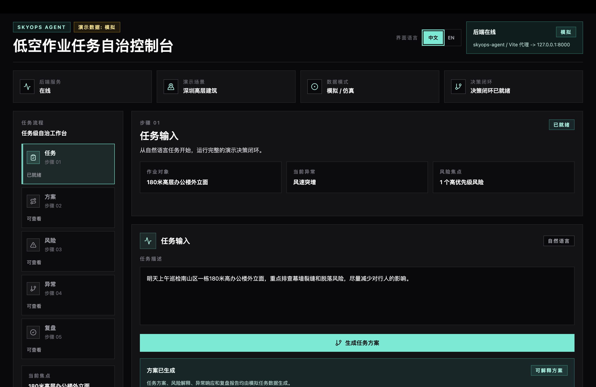
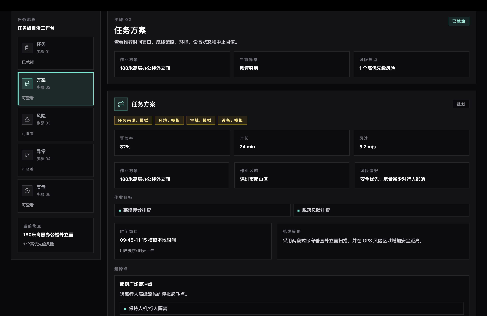
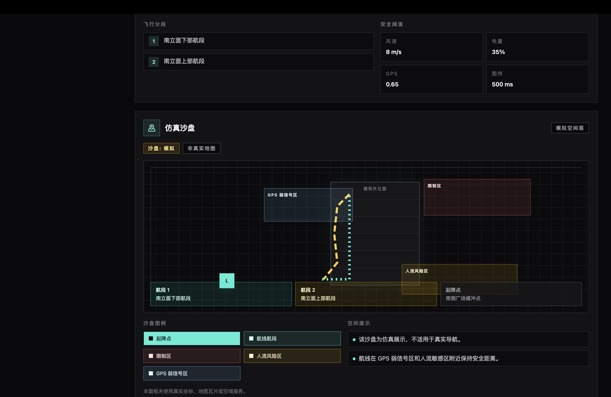
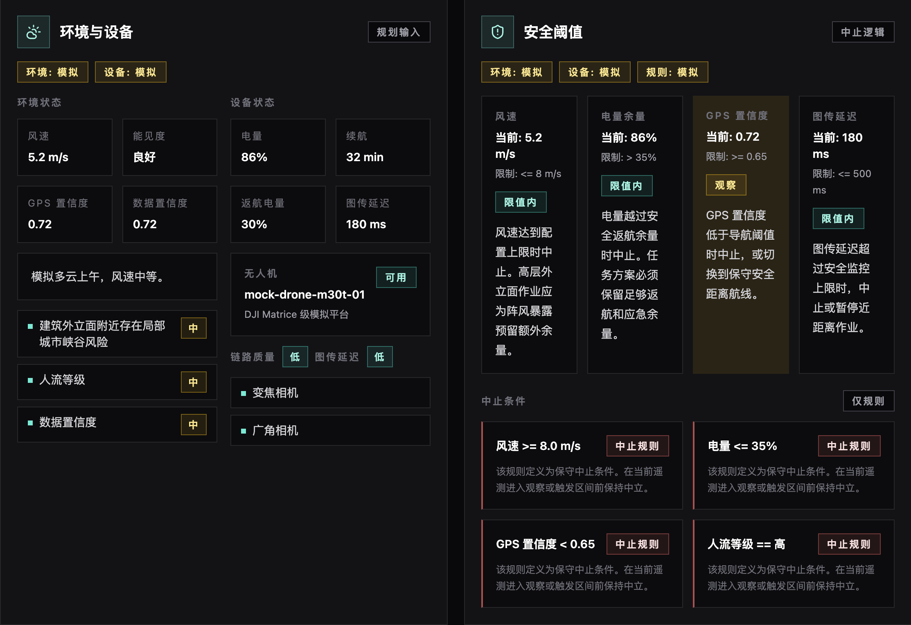
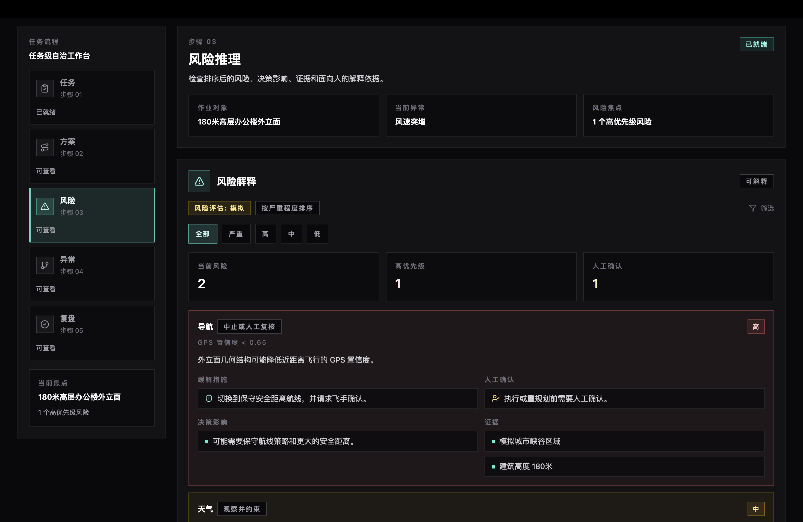
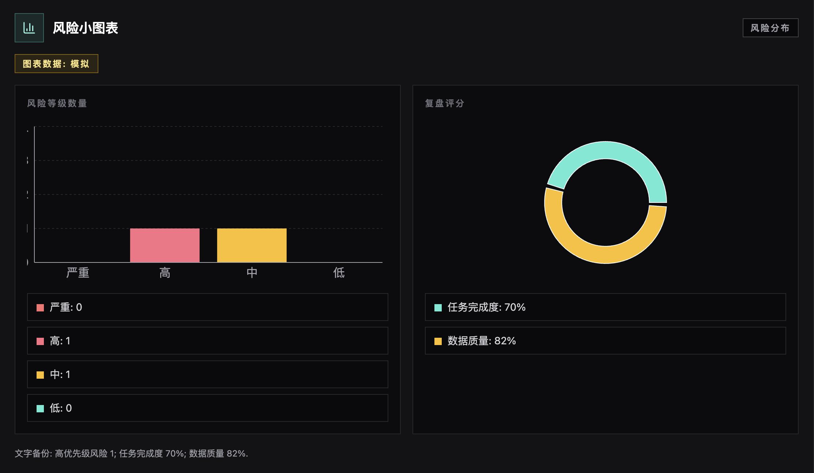
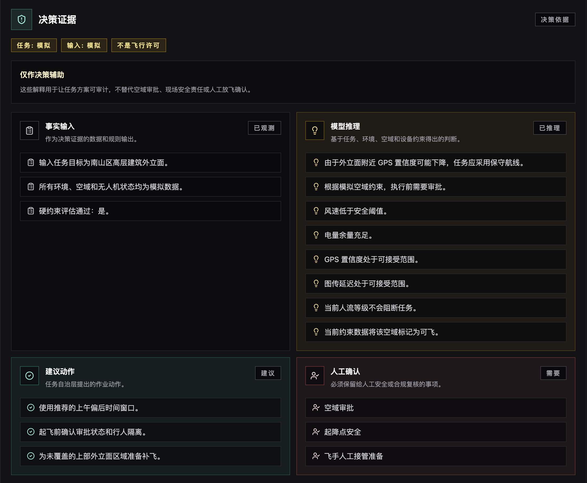
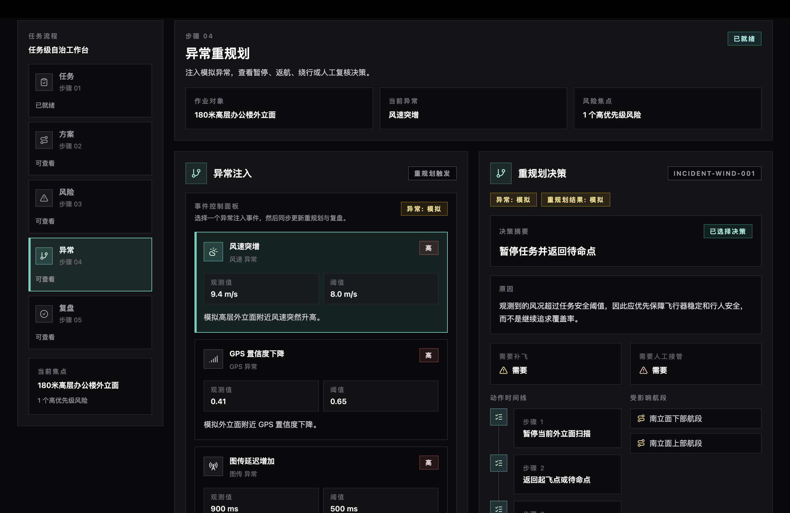
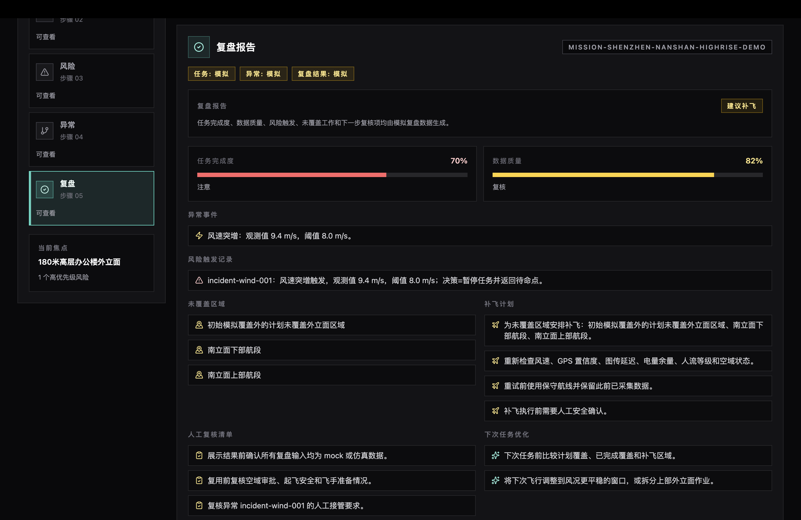
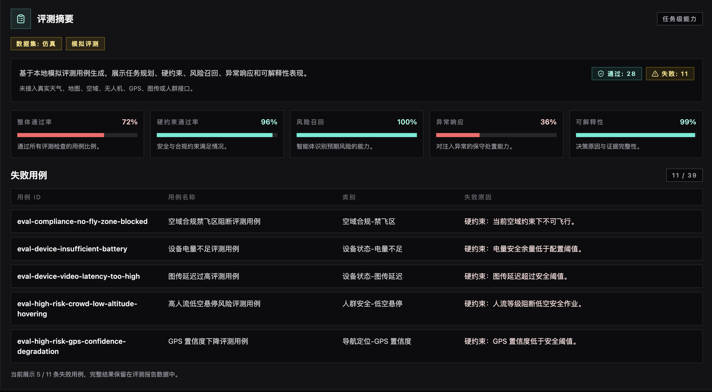

# SkyOps Agent 初赛技术方案

| 项目要素 | 当前内容 |
| --- | --- |
| 项目定位 | 面向深圳低空经济的低空作业任务自治与风险推演智能体 |
| 当前阶段 | 初赛 Demo，已完成 Phase 3 评测体系与 Phase 4-lite LLM 接口边界 |
| 首个场景 | 深圳高层建筑外立面巡检任务自治与风险推演 |
| 数据说明 | 当前任务、天气、空域、设备、人流和评测数据均为 mock/simulated |
| 源代码仓库 | https://github.com/DXL-0702/SkyOps |

## 1. 项目摘要

SkyOps Agent 是面向深圳低空经济场景的低空作业任务自治与风险推演智能体。它的核心目标不是识别无人机图像中的缺陷，也不是替代无人机飞控系统，而是在低空作业任务执行前、中、后提供任务级自治决策支持。

SkyOps Agent 关注的问题是：

- 当前任务该不该飞。
- 什么时间窗口更安全。
- 应该选择怎样的起降点、航线策略、设备配置和任务拆分方式。
- 遇到风速突增、GPS 置信度下降、图传延迟、电量不足、人群聚集、临时空域限制等异常时如何处置。
- 如果任务无法一次完成，如何生成补飞计划。
- 如何让每次低空作业都有可解释、可复盘、可持续优化的闭环。

项目当前版本已经实现前后端基础工程、任务规划闭环、显式硬约束规则、异常重规划、任务复盘、评测数据集、评测指标、Evaluation report JSON、前端任务运营控制台，以及 Phase 4-lite LLM adapter 安全边界。当前版本使用 mock/simulated 数据，不接入真实无人机、不控制真实飞行、不调用真实 LLM API。

一句话概括：

```text
SkyOps Agent 的核心不是“检测缺陷”，而是让低空作业任务更安全、更高效、更可解释、更可复盘。
```

当前工程完成度如下：

| 能力模块 | 当前状态 | 主要证据 |
| --- | --- | --- |
| 任务规划闭环 | 已实现 | `mission_planner.py`、Mission API、前端任务方案面板 |
| 显式安全规则 | 已实现 | `rules/engine.py`、hard constraint tests |
| 风险推演与解释 | 已实现 | `RiskItem`、human explanation、风险解释面板 |
| 异常重规划 | 已实现 | `incident_replanner.py`、异常注入与重规划面板 |
| 任务复盘与补飞 | 已实现 | `mission_reviewer.py`、复盘报告面板 |
| 仿真评测体系 | 已实现 | 39 个 mock/simulated cases、evaluation runner、report JSON |
| LLM 接口边界 | Phase 4-lite 已实现 | `LLMProvider` contract、`MockLLMProvider`、adapter regression tests |
| 前端运营控制台 | 已实现 | React + Vite + Tailwind Console、中文/英文与主题切换 |

当前可复现实证如下：

| 维度 | 当前结果 |
| --- | ---: |
| mock/simulated 评测用例 | 39 |
| 通过 / 失败用例 | 28 / 11 |
| 硬约束通过率 | 0.963 |
| 风险召回率 | 1.000 |
| 可解释性得分 | 0.9882 |
| 后端测试 | 105 passed |

## 2. 背景与问题定义

随着深圳低空经济和无人机产业发展，无人机硬件、飞控、机库、图像采集、热成像、LiDAR 和常见缺陷识别能力已经相对成熟。低空作业规模化落地的瓶颈，正在从“能不能飞”转向“能不能安全、合规、稳定地运营”。

传统无人机巡检系统通常重点解决“图像里有没有裂缝、热斑或缺陷”。这类能力重要，但它属于任务执行后的数据分析层。SkyOps Agent 选择解决更上游的问题：在任务开始前，是否应该飞；在任务进行中，异常发生后是否应该继续；在任务结束后，如何复盘和补飞。

对低空作业而言，真正影响任务成败的因素通常是多源约束共同作用：

- 天气和风速。
- GPS 置信度和建筑遮挡。
- 图传延迟和链路质量。
- 空域限制和审批要求。
- 人流密度和地面安全。
- 电量余量、返航阈值和载荷能力。
- 任务覆盖率、数据质量和业务优先级。

因此，SkyOps Agent 的设计重点不是单点识别模型，而是任务级自治决策层。

## 3. 产品定位与创新点

### 3.1 产品定位

SkyOps Agent 位于三层低空作业体系的中间层：

```text
城市级低空监管 / 空域管理 / UTM 平台
                 |
SkyOps Agent：任务自治与风险推演层
                 |
无人机 / 机库 / 飞控 / 载荷 / 巡检平台
```

它不替代政府低空监管平台，也不替代 DJI 等厂商飞控系统，而是作为任务需求和执行系统之间的智能决策层。

### 3.2 与传统巡检系统的区别

| 对比项 | 传统无人机巡检/识别系统 | SkyOps Agent |
| --- | --- | --- |
| 核心问题 | 图像中是否存在缺陷 | 任务是否安全、合规、可执行 |
| 主要能力 | CV 缺陷识别、报告生成 | 多源约束推理、风险推演、异常重规划 |
| 决策时机 | 多在任务后处理数据 | 覆盖任务前、任务中、任务后 |
| 输出结果 | 缺陷检测结果、巡检报告 | 任务方案、风险解释、补飞计划、复盘建议 |
| 评价指标 | 检测准确率、召回率 | 硬约束通过率、风险召回、异常处置、可解释性 |

建筑外立面巡检只是当前初赛版本的首个场景。该产品本体可以扩展到园区光伏巡检、工地安全巡查、应急救援、园区安防、城市治理、消防巡查、低空测绘和园区物流配送等低空作业任务。

### 3.3 核心创新点

SkyOps Agent 的创新点不在于重复制造图像识别模型，而在于把低空作业任务运营过程工程化：

- **主动感知**：任务执行前主动补齐任务约束，而不是等待用户填写复杂表单。
- **多源约束推理**：综合天气、风速、GPS、空域、人流、电量、图传和业务目标。
- **风险推演**：在执行前对异常条件进行 what-if 分析。
- **自主规划**：生成时间窗口、起降点、航线策略、安全阈值和中止条件。
- **异常重规划**：异常发生后主动给出暂停、返航、绕行、补飞或人工接管方案。
- **闭环复盘**：任务结束后生成完成度、风险记录、未覆盖区域、补飞计划和下次优化建议。
- **可量化评测**：通过 Phase 3 评测集和指标体系验证 Agent 决策能力。

## 4. 系统总体架构

### 4.1 工程架构

当前系统采用前后端分离架构：

```text
Frontend Mission Operations Console
        |
FastAPI Mission API
        |
Mission Orchestrator
        |
Rules / Replanner / Reviewer / Evaluation / LLM Adapter
        |
Mock Scenarios + Evaluation Dataset
```

当前运行链路如下：

```text
自然语言任务
    -> 结构化任务上下文
    -> 显式硬约束评估
    -> 任务方案 + 风险项 + 决策解释
    -> 异常事件注入
    -> 异常重规划
    -> 任务复盘
    -> 评测集回归验证
```

### 4.2 技术栈选择

| 层级 | 技术选择 | 选择原因 |
| --- | --- | --- |
| 后端 API | Python 3.11/3.12 + FastAPI | 适合快速构建类型清晰、可测试的任务决策 API |
| 数据模型 | Pydantic v2 | 将任务、环境、空域、设备、风险、复盘和评测对象结构化 |
| 依赖与运行 | uv | 保持后端依赖安装和测试运行可复现 |
| 测试 | pytest | 覆盖规则、编排、评测、LLM adapter contract 等核心逻辑 |
| 前端 | React + TypeScript + Vite | 构建可交互的任务运营控制台，并保持类型约束 |
| UI 样式 | Tailwind CSS | 快速形成一致的控制台视觉语言和响应式布局 |
| 图标与图表 | lucide-react + Recharts | 表达风险、状态、复盘和评测指标 |
| 数据 | YAML / JSON mock 与 simulated fixtures | 支持仿真 Demo、评测集和后续真实 API 替换 |

技术栈选择遵循两个原则：第一，所有关键决策对象必须结构化，便于前端展示、测试和评测；第二，所有安全规则必须显式实现，不能隐藏在 prompt 或自由文本生成中。

主要模块如下：

| 模块 | 路径 | 说明 |
| --- | --- | --- |
| Mission API | `backend/app/api/routes/mission.py` | 任务规划、异常重规划、复盘接口 |
| 任务规划编排 | `backend/app/core/orchestration/mission_planner.py` | 汇总任务、环境、空域、设备和硬约束 |
| 硬约束规则 | `backend/app/core/rules/engine.py` | 风速、电量、GPS、图传、人流、空域规则 |
| 异常重规划 | `backend/app/core/orchestration/incident_replanner.py` | 异常事件下的保守处置 |
| 任务复盘 | `backend/app/core/orchestration/mission_reviewer.py` | 完成度、风险记录、补飞建议 |
| 评测系统 | `backend/app/core/evaluation/` | 指标合约、评分器、runner、report |
| 评测数据 | `backend/app/data/evaluation/*.yaml` | 39 个 mock/simulated 评测 case |
| LLM 接口 | `backend/app/integrations/llm/` | LLM adapter contract 与 MockLLMProvider |
| 前端控制台 | `frontend/src/features/mission/` | 可视化任务规划、风险、异常和复盘 |
| 评测摘要面板 | `frontend/src/features/evaluation/` | 展示评测摘要和 failed cases |

### 4.3 Agent 能力映射

当前版本不是多进程、多模型的复杂 Agent 框架，而是采用确定性 orchestrator 和模块化组件实现 Agent 能力雏形。

| Agent 能力 | 当前实现映射 |
| --- | --- |
| 任务理解 | `MissionTask` + mock scenario task fields |
| 环境感知 | `EnvironmentState` |
| 空域合规 | `AirspaceConstraint` + hard rules |
| 设备状态 | `DroneState` + battery/link/payload constraints |
| 任务规划 | `mission_planner.py` |
| 风险推演 | `RiskItem` + hard rule risks + evaluation cases |
| 异常处置 | `incident_replanner.py` |
| 报告复盘 | `mission_reviewer.py` |
| 能力量化 | evaluation dataset + metric contracts + runner |
| LLM 辅助 | `LLMProvider` contract + `MockLLMProvider` |

这种实现方式的优点是可测试、可复现、易解释，也更符合低空安全场景的保守策略。未来可在相同接口下替换更复杂的 Agent workflow 或真实 LLM provider，但硬安全规则仍不能被 LLM 覆盖。

## 5. 核心实现一：任务规划与多源约束推理

SkyOps Agent 不只是接收自然语言后生成文本，而是将任务需求、环境状态、空域约束、无人机状态和显式安全规则统一进入任务规划上下文，输出结构化任务方案、风险列表和可解释说明。

关键实现位于 `backend/app/core/orchestration/mission_planner.py`。以下代码保留真实实现中的核心链路，省略了部分字段回填：

```python
def build_mission_planning_result(
    scenario: dict[str, Any],
    raw_user_input: str,
) -> MissionPlanningResult:
    environment_state = EnvironmentState.model_validate(scenario["environment_state"])
    airspace_constraint = AirspaceConstraint.model_validate(scenario["airspace_constraint"])
    drone_state = DroneState.model_validate(scenario["drone_state"])
    rule_evaluation = evaluate_hard_constraints(
        environment_state=environment_state,
        airspace_constraint=airspace_constraint,
        drone_state=drone_state,
    )
    human_explanation = Explanation.model_validate(scenario["human_explanation"])
    human_explanation.facts.append(
        f"Hard constraint evaluation passed: {str(rule_evaluation.passed).lower()}."
    )
    human_explanation.inferences.extend(check.reason for check in rule_evaluation.checks)

    return MissionPlanningResult(
        risks=[*scenario_risks, *rule_evaluation.risks],
        mission_plan=MissionPlan.model_validate(scenario["mission_plan"]),
        human_explanation=human_explanation,
    )
```

这段实现体现了三点：

- 任务规划依赖结构化约束，而不是自由文本猜测。
- 硬约束评估结果会进入风险列表和解释链路。
- 输出对象可被前端、测试和评测系统复用。

因此，SkyOps Agent 的任务方案不是孤立文本，而是结构化、可解释、可回归验证的决策结果。

## 6. 核心实现二：显式硬约束安全规则

低空作业安全不能藏在 prompt 里。SkyOps Agent 将风速、电量、GPS、图传、人流、空域等安全条件实现为显式、可配置、可测试的规则。

关键实现位于 `backend/app/core/rules/engine.py`。以下节选展示规则引擎如何把多个安全检查汇总为统一的硬约束结果：

```python
def evaluate_hard_constraints(
    environment_state: EnvironmentState,
    airspace_constraint: AirspaceConstraint,
    drone_state: DroneState,
    config: SafetyRuleConfig | None = None,
) -> RuleEvaluationResult:
    active_config = config or load_safety_rule_config()
    checks = [
        evaluate_wind(environment_state, active_config),
        evaluate_battery(drone_state, active_config),
        evaluate_gps(environment_state, active_config),
        evaluate_video_latency(drone_state, active_config),
        evaluate_crowd(environment_state, active_config),
        evaluate_airspace(airspace_constraint, active_config),
    ]

    return RuleEvaluationResult(
        passed=all(check.passed for check in checks),
        checks=checks,
    )
```

规则引擎当前覆盖：

- 风速是否超过安全阈值。
- 电量是否满足任务执行和安全返航余量。
- GPS 置信度是否满足自主航线要求。
- 图传延迟是否影响操作员态势感知。
- 人流密度是否阻断低空作业。
- 当前空域是否允许飞行。

当规则失败时，系统会生成对应 `RiskItem`，包括风险等级、触发条件、缓解措施、证据和是否需要人工确认。这样可以保证每个关键安全判断都有依据，而不是由模型自由文本临场生成。

## 7. 核心实现三：异常重规划

任务级自治不是一次性生成方案，而是在异常发生时主动选择暂停、返航、降级、补飞或人工接管等保守策略。

以风速突增为例，`backend/app/core/orchestration/incident_replanner.py` 中的逻辑如下。以下节选保留了重规划决策、动作、补飞要求、人工接管要求和原因说明：

```python
case "wind_speed_spike":
    return ReplanDecision(
        decision="pause_and_return_to_standby",
        actions=[
            "pause current facade scan",
            "return to launch or standby point",
            "preserve collected imagery and telemetry",
            "generate makeup flight for unfinished facade segments",
        ],
        makeup_flight_required=True,
        human_takeover_required=severity_requires_takeover,
        reason=(
            "Observed wind condition exceeds the mission safety threshold, so coverage is "
            "deprioritized in favor of aircraft stability and pedestrian safety."
        ),
    )
```

这段逻辑体现了 SkyOps Agent 的安全策略：

- 风险升高时，任务覆盖率让位于飞行安全和地面安全。
- 异常发生后保留已采集数据，避免重复采集浪费。
- 未完成区域进入补飞计划，而不是继续冒险执行。
- 被拒绝的替代方案被记录，支持可解释决策和复盘。

当前异常重规划覆盖风速突增、GPS 置信度下降、图传延迟增加、电量不足、人群聚集、临时空域限制和未知异常。未知异常默认进入暂停和人工复核流程。

## 8. 核心实现四：闭环复盘与补飞计划

低空作业不是执行一次就结束。SkyOps Agent 在任务完成后生成任务复盘，将异常事件、重规划决策、未覆盖区域、补飞计划和下次优化建议沉淀下来。

关键实现位于 `backend/app/core/orchestration/mission_reviewer.py`。以下节选展示复盘如何把异常和重规划结果转化为风险记录、未覆盖区域、补飞计划和下次优化：

```python
def build_mission_review(
    mission_plan: MissionPlan,
    incident_events: list[IncidentEvent],
    replan_decisions: list[ReplanDecision],
) -> MissionReview:
    uncovered_areas = build_uncovered_areas(mission_plan, replan_decisions)

    return MissionReview(
        mission_id=mission_plan.mission_id,
        risk_trigger_log=build_risk_trigger_log(incident_events, replan_decisions),
        uncovered_areas=uncovered_areas,
        makeup_flight_plan=build_makeup_flight_plan(uncovered_areas, replan_decisions),
        human_review_checklist=build_human_review_checklist(replan_decisions),
        next_mission_optimizations=build_next_mission_optimizations(incident_events),
    )
```

复盘结果包括：

- 任务完成度。
- 数据质量评分。
- 风险触发记录。
- 未覆盖区域。
- 补飞计划。
- 人工复核清单。
- 下次任务优化建议。

这一闭环使 SkyOps Agent 不只是“给一次方案”，而是把低空作业变成可复盘、可积累、可持续优化的运营过程。

## 9. Phase 3 评测体系：让 Agent 能力可量化

为了避免项目只停留在概念层，SkyOps Agent 建立了低空任务仿真评测体系。评测对象不是无人机硬件，不是 CV 缺陷识别模型，而是 Agent 在复杂约束下的任务决策能力。

### 9.1 评测数据集

当前评测集包含 39 个 mock/simulated evaluation cases，覆盖：

- 正常低风险任务。
- 天气、GPS、人流高风险任务。
- 空域合规与临时限制任务。
- 电量、载荷、图传链路任务。
- 异常事件注入任务。
- 多业务扩展场景。

评测数据明确标记为 mock/simulated，不依赖真实天气、真实地图、真实空域、真实无人机或真实人群数据。测试中也加入 guardrail，避免评测目标偏离到传统 CV 缺陷识别准确率。

### 9.2 评测指标

当前评测体系包含五类指标：

| 指标 | 评估内容 |
| --- | --- |
| Hard Constraint Pass Rate | 是否违反禁飞区、审批、风速、电量、GPS、人流等硬约束 |
| Risk Recall | 是否识别出 case 中预设的关键风险 |
| Incident Response Score | 异常发生后是否暂停、返航、保留数据、补飞和人工复核 |
| Explainability Score | 关键决策是否包含事实、推理、建议动作和人工确认事项 |
| Plan Efficiency | 在不牺牲安全的前提下评估覆盖率、拆分次数和补飞负载 |

其中硬约束是 blocking safety gate，方案效率不能抵消安全失败。

评测合约在 `backend/app/core/evaluation/contracts.py` 中明确这一点。以下节选展示 blocking safety gate 不能被方案效率抵消：

```python
class EvaluationMetricContract(BaseModel):
    metric: EvaluationMetricName
    display_name: str
    description: str
    scoring_focus: str
    priority_order: int = Field(ge=1)
    role: EvaluationMetricRole
    blocks_overall_pass: bool = False
    can_be_offset_by_plan_efficiency: bool = False

    @model_validator(mode="after")
    def require_safety_gate_to_block_without_efficiency_offset(
        self,
    ) -> "EvaluationMetricContract":
        if self.role != EvaluationMetricRole.BLOCKING_SAFETY_GATE:
            return self
        if not self.blocks_overall_pass:
            raise ValueError("Blocking safety gates must block the overall result.")
        if self.can_be_offset_by_plan_efficiency:
            raise ValueError("Blocking safety gates cannot be offset by plan efficiency.")
        return self
```

### 9.3 Evaluation runner

Evaluation runner 将每个 case 依次经过任务规划、异常重规划、任务复盘和评分链路，保证评测不是孤立的单元测试，而是端到端决策链路的回归验证。

关键实现位于 `backend/app/core/evaluation/runner.py`。以下节选展示每个评测用例会经过规划、重规划、复盘和评分：

```python
def run_evaluation_case_fixture(fixture: EvaluationCaseFixture) -> EvaluationResult:
    planning_result = build_mission_planning_result(
        scenario=_build_runner_scenario(fixture),
        raw_user_input=fixture.evaluation_case.raw_user_input,
    )
    replan_decisions = [
        build_replan_decision(
            incident_event=incident_event,
            mission_plan=planning_result.mission_plan,
        )
        for incident_event in fixture.evaluation_case.incident_events
    ]
    mission_review = build_mission_review(
        mission_plan=planning_result.mission_plan,
        incident_events=fixture.evaluation_case.incident_events,
        replan_decisions=replan_decisions,
    )
    result = score_evaluation_case(
        evaluation_case=fixture.evaluation_case,
        mission_plan=planning_result.mission_plan,
        risks=planning_result.risks,
        human_explanation=planning_result.human_explanation,
        replan_decisions=replan_decisions,
        mission_review=mission_review,
    )
    return result.model_copy(update={"generated_at": DETERMINISTIC_EVALUATION_GENERATED_AT})
```

runner 使用固定 timestamp，保证评测结果可重复运行和回归比较。

### 9.4 Evaluation report JSON

评测报告用于连接后端评测、前端摘要面板和技术方案数据表。报告明确标记数据来源为 mock/simulated，并保留 failed cases 和 failure reasons。

关键实现位于 `backend/app/core/evaluation/report.py`。以下节选展示报告会保留数据来源、是否使用真实 API、指标均值和失败用例：

```python
return {
    "report_type": REPORT_TYPE,
    "data_origin": DATA_ORIGIN,
    "uses_real_api": False,
    "case_count": case_count,
    "passed_count": passed_count,
    "failed_count": case_count - passed_count,
    "hard_constraint_pass_rate": _average_metric(case_results, "hard_constraint_pass_rate"),
    "risk_recall_avg": _average_metric(case_results, "risk_recall"),
    "incident_response_avg": _average_metric(case_results, "incident_response_score"),
    "explainability_avg": _average_metric(case_results, "explainability_score"),
    "case_results": case_results,
    "failed_cases": failed_cases,
}
```

当前本地 mock/simulated evaluation report 摘要如下：

| 字段 | 当前结果 |
| --- | ---: |
| case_count | 39 |
| passed_count | 28 |
| failed_count | 11 |
| hard_constraint_pass_rate | 0.963 |
| risk_recall_avg | 1.000 |
| incident_response_avg | 0.359 |
| explainability_avg | 0.9882 |

这些数字不是生产认证结果，也不是对真实飞行能力的承诺，而是当前 mock/simulated 评测集下的可复现测试结果。failed cases 的存在是刻意保留的，它们用于暴露当前规则、异常响应和基准方案的薄弱点，支持后续持续优化。

## 10. Phase 4-lite：LLM 接口边界与安全设计

比赛主题强调 Agent 能力，因此 SkyOps Agent 在初赛阶段增加了 Phase 4-lite：定义 LLM adapter contract、实现 MockLLMProvider，并用测试约束 LLM 的能力边界。

当前版本不接真实 LLM API。这样做不是因为系统没有 LLM 扩展能力，而是因为低空作业场景必须优先证明安全边界、可复现性和责任划分。

核心原则是：

```text
LLM can suggest, but cannot approve flight.
```

### 10.1 三层智能边界

| 层级 | 职责 | 当前实现 | 安全边界 |
| --- | --- | --- | --- |
| Deterministic Safety Layer | 风速、电量、GPS、图传、人流、空域等硬约束判断 | `backend/app/core/rules/engine.py`、evaluation scoring | 阻断不安全或不合规方案，不能被 LLM 覆盖 |
| Agent Reasoning Layer | 任务理解、多源约束推理、任务规划、异常重规划、闭环复盘 | `mission_planner.py`、`incident_replanner.py`、`mission_reviewer.py`、evaluation runner | 生成结构化方案、风险、补飞与复盘，接受规则和评测约束 |
| LLM Assistance Layer | 自然语言解析、主动澄清、解释生成、复盘摘要润色 | `LLMProvider` contract、`MockLLMProvider` | 只输出 draft / suggestion / explanation，不批准飞行 |

### 10.2 LLM adapter contract

LLM contract 位于 `backend/app/integrations/llm/contracts.py`，定义了 LLM 能输出什么、不能输出什么、失败时如何降级。

```python
class LLMUsagePolicy(BaseModel):
    can_parse_task: bool = True
    can_suggest_missing_constraints: bool = True
    can_generate_explanation: bool = True
    can_summarize_review: bool = True
    can_approve_flight: bool = False
    can_override_hard_constraints: bool = False
    can_bypass_human_review: bool = False
    can_change_safety_thresholds: bool = False
    safety_statement: str = "LLM can suggest, but cannot approve flight."

    @model_validator(mode="after")
    def require_assistive_llm_boundary(self) -> "LLMUsagePolicy":
        if self.can_approve_flight:
            raise ValueError("LLM can suggest, but cannot approve flight.")
        if self.can_override_hard_constraints:
            raise ValueError("LLM cannot override hard constraints.")
        if self.can_bypass_human_review:
            raise ValueError("LLM cannot bypass human review.")
        if self.can_change_safety_thresholds:
            raise ValueError("LLM cannot change safety thresholds.")
        return self
```

### 10.3 MockLLMProvider

MockLLMProvider 位于 `backend/app/integrations/llm/mock_provider.py`，用于展示未来真实 LLM provider 的接入位置，但它不请求网络、不读取 API key、不改变硬安全规则。以下节选展示 task parsing draft 仍然显式标注 mock、deterministic 和 safety notes：

```python
MOCK_SAFETY_NOTE = (
    "Mock LLM output is a draft only; deterministic hard rules and human review "
    "must decide safety-critical actions; it does not approve flight."
)

class MockLLMProvider:
    provider_name = MOCK_PROVIDER_NAME
    usage_policy = LLMUsagePolicy()

    def parse_task(
        self,
        raw_user_input: str,
        context: dict[str, Any],
    ) -> TaskUnderstandingDraft:
        normalized_input = raw_user_input.lower()
        operation_object = _infer_operation_object(normalized_input)
        operation_area = _infer_operation_area(raw_user_input, context)
        requested_time_window = _infer_time_window(raw_user_input, normalized_input)
        missing_fields = [
            field_name
            for field_name, field_value in {
                "operation_object": operation_object,
                "operation_area": operation_area,
                "requested_time_window": requested_time_window,
            }.items()
            if not field_value
        ]

        return TaskUnderstandingDraft(
            source_type=DataSourceType.MOCK,
            provider=self.provider_name,
            deterministic=True,
            operation_object=operation_object,
            operation_area=operation_area,
            requested_time_window=requested_time_window,
            missing_fields=missing_fields,
            requires_human_review=bool(missing_fields),
            safety_notes=[MOCK_SAFETY_NOTE, "This draft does not approve flight."],
        )
```

LLM 在当前系统中的作用是辅助任务理解、约束补齐、解释生成和复盘摘要润色。它不能直接批准飞行，不能绕过禁飞区或审批要求，不能覆盖风速、电量、GPS、图传、人流、空域等硬约束规则，也不能替代人工安全责任人。

未来如果接入真实 LLM provider，也必须实现同一 `LLMProvider` adapter contract，所有输出仍然是 draft/suggestion/explanation，并经过确定性规则和人工复核约束。

## 11. 前端任务运营控制台

SkyOps Agent 的前端不是营销 landing page，也不是普通聊天窗口，而是任务级自治决策的运营控制台。

当前 Mission Operations Console 展示：

- 任务输入和后端连接状态。
- 任务方案摘要。
- 环境、设备和空域状态。
- 风险列表与风险解释。
- 异常事件注入与重规划结果。
- 任务复盘和补飞建议。
- Evaluation Summary Panel。
- 中英文切换和深浅色主题切换。

前端界面在技术方案中的作用是证明系统已经具备可操作的任务运营工作台，而不是仅有后端 API 或概念说明。以下截图均来自当前本地 mock/simulated Demo，界面中的模拟数据标识用于明确区分演示数据和真实运行数据。



图 1 展示 Mission Operations Console 的整体结构。左侧按照任务、方案、风险、异常和复盘组织任务级自治流程，顶部显示后端状态、演示场景和数据模式，主体区域以自然语言任务作为入口，强调用户像对低空调度员描述任务，而不是填写复杂工业表单。



图 2A 展示任务方案摘要。系统将自然语言任务转换为结构化任务对象、作业区域、作业目标、时间窗口、航线策略和起降点建议。



图 2B 展示仿真沙盘。该视图不是真实地图，而是用来表达航线、起降点、GPS 弱信号区、限制区和人流风险区之间的空间关系，证明任务方案不是孤立文本，而是围绕多源约束生成。



图 2C 展示环境、设备状态和安全阈值。风速、电量、GPS 置信度、图传延迟等约束被显式展示为可检查规则，后续接入真实数据源时也应继续保持这种显式安全边界。



图 3A 展示风险解释面板。风险按照严重程度排序，并显示触发条件、缓解措施、决策影响、证据来源和是否需要人工确认。



图 3B 作为辅助视图，汇总当前风险分布和复盘评分，帮助用户快速扫描整体状态。



图 3C 展示决策证据面板。系统把关键结论拆分为事实输入、模型推理、建议动作和人工确认事项，避免把 Agent 输出做成不可审计的黑盒结论。三张图共同说明：风险模块不仅“报风险”，还要说明风险从何而来、如何影响决策、哪些事项必须交给人工复核。



图 4 展示异常重规划能力。注入风速突增、GPS 置信度下降、图传延迟、电量不足、人流聚集或临时空域限制后，系统会输出暂停、返航、保留数据、补飞和人工接管等保守处置。



图 5 展示任务复盘。系统在任务结束或异常处置后记录任务完成度、数据质量、风险触发、未覆盖区域、补飞计划、人工复核清单和下次任务优化建议，形成闭环。



图 6 展示评测摘要。该面板基于本地 mock/simulated 评测用例生成，用于证明 SkyOps Agent 的任务决策能力可以被量化、回归和复盘，而不是只停留在概念演示。

## 12. 安全、合规与实现边界

SkyOps Agent 是低空作业任务决策辅助系统，不是规避监管工具，也不替代真实飞控系统。

当前版本边界如下：

- 使用 mock/simulated 数据，不接入真实无人机。
- 不控制真实无人机起飞、降落或航线执行。
- 不接入真实天气、真实地图、真实空域、真实 UTM 或真实人群数据。
- 不调用真实 LLM API。
- 不保存或提交 API key。
- 不承诺绕过审批。
- 不替代政府监管、UTM 平台、飞控系统或人工安全责任人。

安全策略如下：

- 当任务安全与覆盖效率冲突时，优先安全与合规。
- 当硬约束失败时，方案效率不能抵消安全失败。
- 当数据不足或风险不确定时，应建议人工复核、暂停执行或启用保守方案。
- 当 LLM 输出与安全边界冲突时，应触发 fallback 和人工复核。

边界声明：

```text
SkyOps Agent can assist low-altitude mission decisions, but it cannot replace legal approval, airspace compliance checks, flight-control systems, or human safety responsibility.
```

## 13. 测试与质量保证

当前后端测试覆盖任务规划、硬约束、异常重规划、复盘、评测数据集、评测评分器、评测报告和 LLM adapter 安全边界等核心模块。

已具备的测试类型包括：

- health check。
- scenario loader tests。
- mission plan contract tests。
- hard constraint rule tests。
- incident replanner tests。
- mission reviewer tests。
- mission orchestrator tests。
- evaluation model tests。
- evaluation loader tests。
- evaluation contract tests。
- evaluation scoring tests。
- evaluation runner tests。
- evaluation report tests。
- evaluation regression tests。
- LLM contract tests。
- MockLLMProvider tests。
- LLM adapter contract regression tests。

当前版本本地验证结果：

```bash
cd backend
UV_CACHE_DIR=/private/tmp/skyops-uv-cache uv run pytest
```

```text
105 passed, 1 warning in 6.18s
```

说明：该 warning 来自当前沙箱环境下 pytest cache 写入受限，不影响测试结论。

```bash
cd frontend
npm run build
```

```text
✓ built in 1.18s
```

说明：Vite 输出 chunk size warning，属于打包体积提示，不是构建失败。本文只记录已经实际运行得到的测试和构建结果，不使用未生成的覆盖率或生产认证指标。

## 14. 当前不足与后续路线

当前版本虽然已经完成核心工程闭环，但仍有明确边界和后续改进方向。

当前不足：

- 使用 mock/simulated 数据，不代表真实生产环境能力。
- 尚未接入真实天气、地图、空域、UTM、无人机或机库系统。
- 尚未接入真实 LLM provider。
- Evaluation report 当前用于本地评测与演示，不是飞行安全认证结果。
- 前端演示截图来自当前本地 Demo，用于说明任务级自治工作台形态，不代表真实飞行调度系统已经上线。

后续路线：

1. 接入真实天气 API 和地图/OSM 数据。
2. 预留 UTM/空域平台 adapter。
3. 预留 DJI Pilot、机库系统或企业巡检平台 adapter。
4. 增加任务历史、复盘历史和评测历史存储。
5. 扩展更多低空作业评测 case。
6. 在相同 LLM adapter contract 下接入真实 provider。
7. 引入更复杂的 Agent workflow，但仍保持硬安全规则优先。

## 15. 总结

SkyOps Agent 面向低空经济规模化落地中的任务运营问题。它不把重点放在图像缺陷识别，而是把低空作业中的安全、合规、风险、异常处置和任务闭环工程化。

当前版本已经形成完整证据链：

- 任务规划：把任务、环境、空域、设备和硬约束统一进入规划上下文。
- 安全规则：用显式规则处理风速、电量、GPS、图传、人流和空域。
- 异常重规划：异常发生后优先暂停、返航、保留数据、补飞和人工复核。
- 闭环复盘：任务结束后生成完成度、风险记录、未覆盖区域和优化建议。
- 评测体系：用 39 个 mock/simulated cases 和多维指标量化 Agent 决策能力。
- LLM 边界：预留 LLM adapter 和 MockLLMProvider，但不让 LLM 批准飞行或覆盖硬安全规则。

因此，SkyOps Agent 体现的是 AI Agent 从被动响应到主动思考与自主行动的转变：它不只是回答用户问题，而是围绕低空作业任务主动感知约束、推演风险、生成方案、处理异常、形成复盘，并通过评测系统持续验证和优化。
